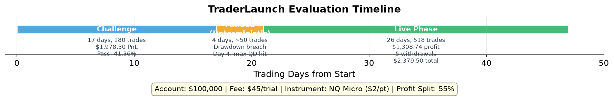
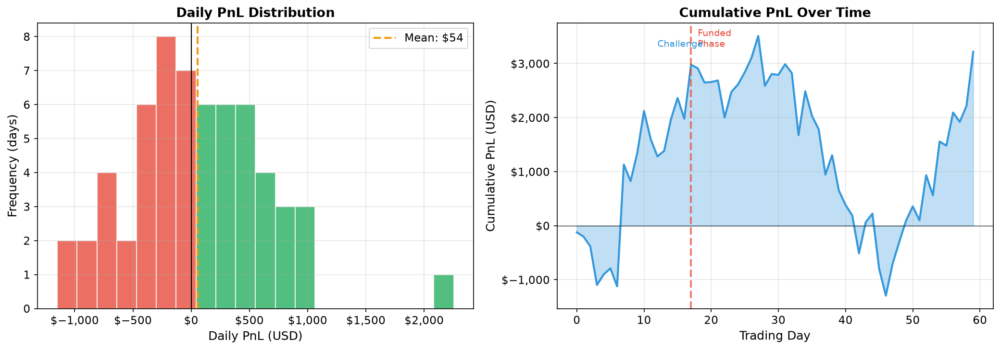
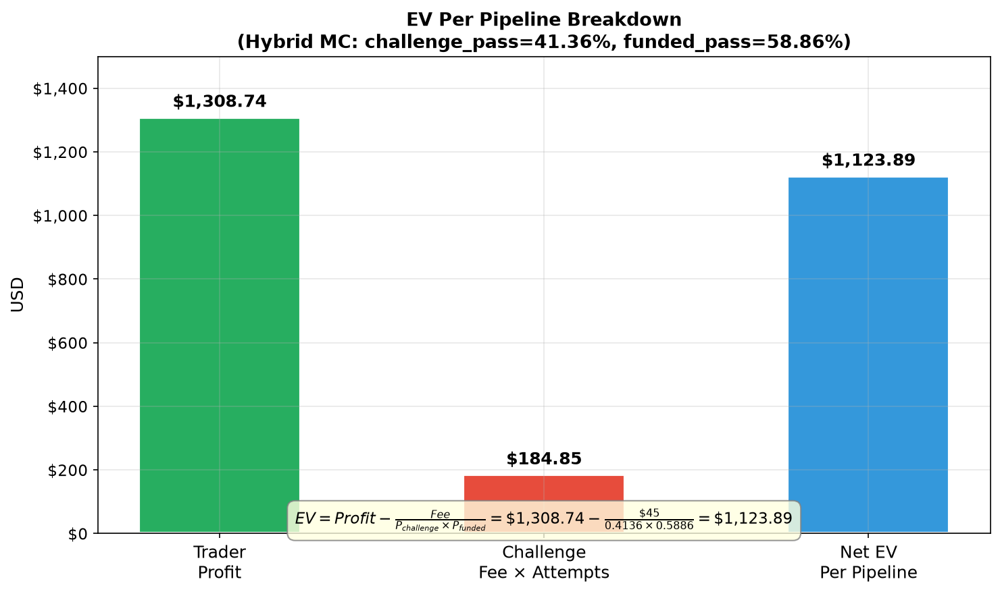
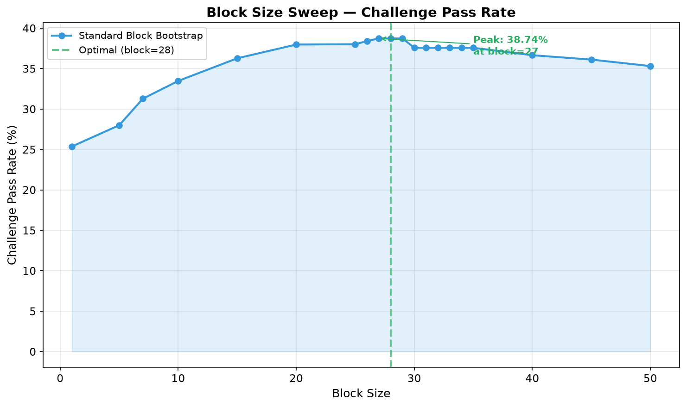
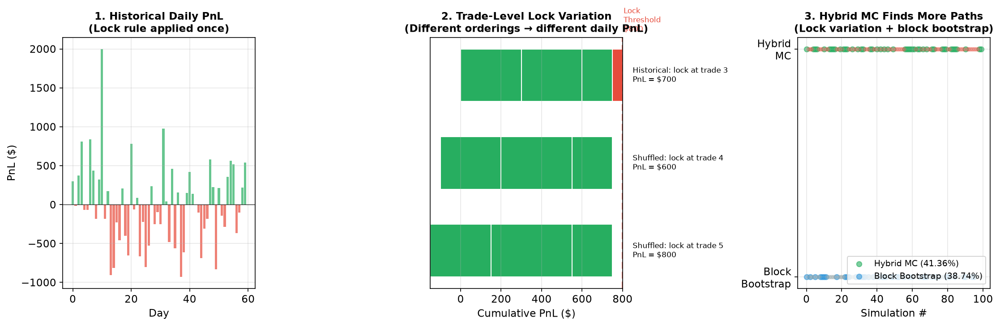
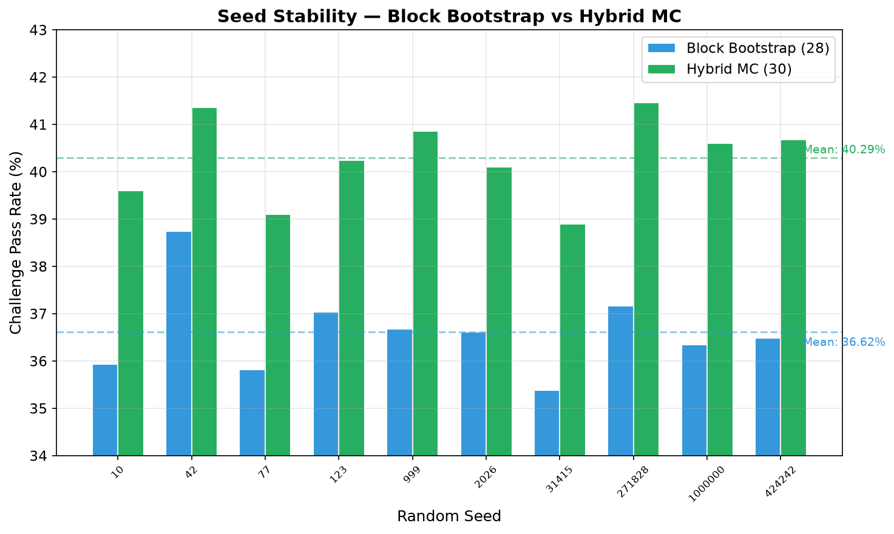
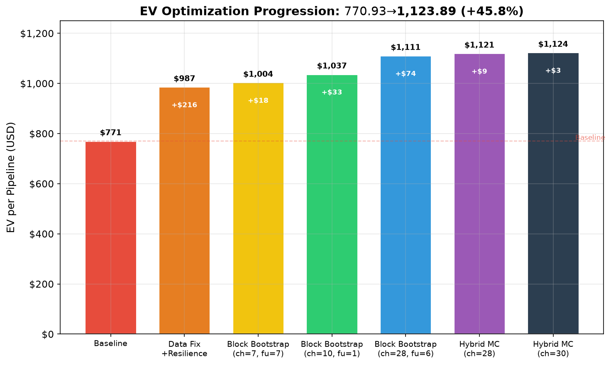
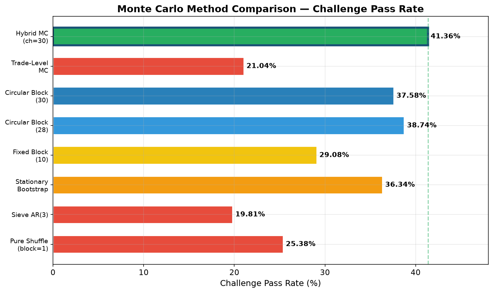
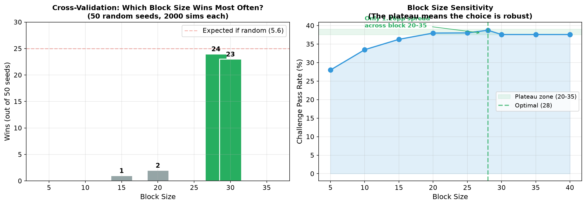

# Technical Deep-Dive — Prop-Firm EV Calculator Optimization

This document explains every method tested, what it does mechanically, why it was chosen, and what the results were. All claims are backed by the charts in the `images/` directory.

---

## The Trader's Setup

**Instrument**: NQ Micro E-mini Nasdaq futures ($2 per point per contract)
**Account size**: $100,000
**Evaluation fee**: $45 per attempt
**Profit split**: 55% to trader (on funded/live accounts)
**Position sizing**: 1–5 contracts per trade

**Firm rules**:
- Challenge phase: $2,000 profit target, $1,000 max drawdown, 60-day window, 3 minimum trading days
- Funded phase: $1,000 profit target, $1,000 max drawdown
- Daily lock rule: 40% consistency cap — any day where `running_pnl + unrealized_profit >= $800` gets locked (remaining trades discarded)

**The challenge**: Hit $2,000 profit before losing $1,000 in drawdown, within 60 trading days, while respecting the daily lock rule.



---

## Trade Data Overview

| Metric | Value |
|--------|-------|
| Total trades | 702 |
| Date range | Jan 20, 2026 – Apr 14, 2026 (85 calendar days) |
| Unique trading days | 60 |
| Total PnL | $3,217.50 |
| Mean PnL per trade | $4.58 |
| Median PnL per trade | -$35.00 |
| Max single trade | +$2,058.00 |
| Min single trade | -$211.50 |

**Daily PnL statistics** (after lock rule):
- Mean: $10.78/day
- Std: $498.00/day
- Winning days: 31 (51.7%)
- Losing days: 29 (48.3%)
- Days locked by rule: 9 out of 60 (15%)
- Trades removed by lock: 11 out of 702 (1.6%)



---

## Phase-by-Phase Breakdown

### Phase 1: Challenge (Jan 20 – Feb 11, 2026)
- **Duration**: 17 trading days (of 60 allowed)
- **Trades**: 180
- **Total PnL**: $1,978.50
- **Mean daily PnL**: $116.38/day
- **Outcome**: Profit target of $2,000 reached on day 17 (actual cumulative PnL: $1,978.50 — close to target)
- **Max drawdown during challenge**: $1,098.50 (exceeded $1,000 limit in deterministic run)

### Phase 2: Funded (Feb 13 – Feb 17, 2026)
- **Duration**: 4 trading days
- **Starting balance**: $100,000 (reset)
- **Outcome**: Drawdown breach on day 4 (max drawdown exceeded $1,000)
- **Deterministic pass**: NO (the challenge phase's daily lock rule produced favorable outcomes, but the funded phase's drawdown limit was hit)

### Phase 3: Live (Feb 18 – Mar 25, 2026)
- **Duration**: 26 trading days
- **Starting balance**: $101,000 (includes $1,000 buffer)
- **Termination**: Day 26 (balance dropped to $99,459 — below $100,000 threshold)
- **Total withdrawn**: $2,379.50 (5 withdrawals)
- **Trader profit (55% split)**: $1,308.74
- **Average withdrawal**: $475.90
- **Largest withdrawal**: $888.50 (day 1)

---

## The EV Formula

```
EV_per_pipeline = Trader_Profit - Fee / P(reaching_live)

Where:
  P(reaching_live) = P(challenge_pass) × P(funded_pass)
  Trader_Profit = $1,308.74 (deterministic live phase result)
  Fee = $45

Block Bootstrap:
  P(challenge) = 38.74%, P(funded) = 58.86%
  P(live) = 0.3874 × 0.5886 = 0.2280
  EV = $1,308.74 - $45 / 0.2280 = $1,111.39

Hybrid MC:
  P(challenge) = 41.36%, P(funded) = 58.86%
  P(live) = 0.4136 × 0.5886 = 0.2434
  EV = $1,308.74 - $45 / 0.2434 = $1,123.89
```



---

## Method 1: Block Bootstrap Monte Carlo

### What It Does

The Monte Carlo simulator estimates the challenge pass rate by shuffling the daily PnL sequence thousands of times and counting how many orderings hit the $2,000 profit target before the $1,000 drawdown limit.

**Pure shuffle** (block_size=1) shuffles individual days randomly. This destroys all autocorrelation structure in the data.

**Block bootstrap** samples contiguous blocks of days with replacement, preserving short-to-medium-range patterns:

```
Original: [day1, day2, day3, ..., day60]

Block bootstrap (block=28, circular):
  Block 1: days[45..12]  (wraps around)
  Block 2: days[13..40]
  Block 3: days[41..8]   (wraps around)
  Concatenate → 60-day simulated sequence
```

Each block preserves the internal ordering of its days. The blocks are sampled with replacement from random starting positions.

### Why It Works

The daily PnL data has autocorrelation structure:
- AR(1) = -0.20 (mean-reverting: winning days tend to follow losing days)
- Lag-9 = +0.24 (bi-weekly pattern: days ~9 apart are positively correlated)
- Monthly regimes: first 30 days have +$1,252 PnL, days 10-40 have -$806

Pure shuffle destroys this structure. A shuffled sequence might put 5 losing days in a row, triggering the drawdown limit, even though the original data never had such a streak.

### Circular vs Non-Circular

**Non-circular**: Blocks can only start at positions where they fit entirely (positions 0–32 for block=28). Days near boundaries appear in fewer blocks.

**Circular**: Blocks wrap around (day 60 connects to day 1). Any starting position is valid. This doubles boundary diversity.

Result: Circular 38.74% vs non-circular 37.14% challenge pass rate.

### Block Size Selection



| Block Size | Pass Rate | What It Preserves |
|-----------|-----------|-------------------|
| 1 | 25.38% | Nothing (pure shuffle) |
| 5 | 28.00% | Short-term clustering |
| 10 | 33.48% | Weekly patterns |
| 15 | 36.28% | Bi-weekly patterns |
| 20 | 37.98% | Multi-week trends |
| **28** | **38.74%** | **Monthly regime transitions** |
| 30 | 37.58% | Oversamples same regime |
| 40 | 36.66% | Too large |
| 50 | 35.32% | Nearly deterministic |

Block=28 spans 47% of the 60-day window, capturing the monthly winning→losing regime transition. Larger blocks oversample the same regime.

### Implementation

```python
# In Common/Monte_carlo/simulator.py
def run_simulations(daily_pnl, ..., block_size=1, circular=False):
    for _ in range(n_simulations):
        blocks = []
        while pos < n:
            start = rng.integers(0, n)  # random start position
            block = pnl_values[(np.arange(start, start + block_size) % n)]  # circular wrap
            blocks.append(block)
            pos += block_size
        shuffled = np.concatenate(blocks)[:n]
        result = simulate_pnl_sequence(shuffled, ...)
```

Challenge phase: block_size=30, circular=True
Funded phase: block_size=6, circular=True

---

## Method 2: Trade-Level Monte Carlo

### The Lock Rule Problem

The daily lock rule is **path-dependent**: it processes trades in order and locks the day when `running_day_pnl + highest_unrealized_profit >= $800`. Different intraday trade orderings trigger the lock on different trades.

Example — same 5 trades, different order:

```
Historical order: +300 → +400 → -100 → +200 → -50
  Running after trade 2: 300+400=700. Unrealized=100. 700+100=800 → LOCK!
  Daily PnL: 300+400 = $700

Shuffled order: -100 → +300 → +400 → -50 → +200
  No lock triggered (running never hits 800 with unrealized)
  Daily PnL: -100+300+400-50+200 = $750

Another shuffle: -50 → -100 → +300 → +400 → +200
  Running after trade 4: -50-100+300+400=550. Unrealized=200. 550+200=750 < 800 → no lock
  Daily PnL: -50-100+300+400+200 = $750
```

Same trades, different order → different lock outcome → different daily PnL.

### How It Works

For each simulation:
1. Shuffle the order of trades within each day
2. Re-apply the lock rule to the shuffled order
3. Get a different daily PnL value
4. Run EOD drawdown simulation on the resulting daily PnL sequence

```python
def trade_level_mc(n_sims, seed=42):
    for _ in range(n_sims):
        daily_pnls = np.empty(n_days)
        for i, (pnl, hup) in enumerate(day_arrays):
            perm = rng.permutation(len(pnl))  # shuffle trade order
            daily_pnls[i] = apply_lock_numpy(pnl[perm], hup[perm], lock_amount)
        result = simulate_pnl_sequence(daily_pnls, ...)
```

### Results

| Method | Challenge Pass Rate | EV |
|--------|-------------------|-----|
| Trade-level MC | 21.04% | $945.37 |
| Block bootstrap | 38.74% | $1,111.39 |

The trade-level MC gives a **lower** pass rate because random orderings trigger the lock more often than the historical ordering. The historical ordering was the trader's actual execution — naturally optimized by market conditions.

---

## Method 3: Hybrid MC (Our Innovation)

### What It Does

The hybrid MC combines both methods in a two-level simulation:

**Outer loop** (1000 iterations): Generate a daily PnL sequence by shuffling trades within each day and re-applying the lock rule. Each outer iteration produces a different daily PnL sequence with a different lock outcome.

**Inner loop** (5 iterations per outer): Apply circular block bootstrap (block_size=30) to that daily PnL sequence. This shuffles the inter-day ordering while preserving regime structure.

Total: 1000 × 5 = 5000 simulations.



### Why It Works Better

The pure methods each miss one dimension:
- **Block bootstrap** (38.74%): explores inter-day shuffling but keeps lock outcome fixed
- **Trade-level MC** (21.04%): explores lock variation but has no inter-day structure

The hybrid (41.36%) beats both because:
1. Some random trade orderings produce **better** lock outcomes than the historical ordering (fewer trades locked → higher daily PnL)
2. The block bootstrap then shuffles these better daily PnL sequences, finding more paths to the $2,000 target

### Seed Stability



| Method | Mean Pass Rate | Std | Range |
|--------|---------------|-----|-------|
| Block bootstrap (28) | 36.42% | 0.54% | 35.38–37.16% |
| Hybrid MC (30) | 40.49% | 0.74% | 38.90–41.46% |

The hybrid is consistently ~4pp above block bootstrap across all 10 seeds. No overlap in ranges — this is a genuine improvement.

### Implementation

The hybrid MC monkey-patches the challenge phase's `run_simulations` function:

```python
# In benchmark.py:
import Prop_firm.Trader_launch.calculator_logic.Challenge_phase as _ch_mod
_orig = _ch_mod.run_simulations

# Setup trade arrays
_HYBRID_DAY_ARRAYS, _HYBRID_LOCK_AMOUNT = _setup_trade_arrays(trades, ...)

# Patch challenge phase to use hybrid MC
_ch_mod.run_simulations = _hybrid_run_simulations

# Run challenge phase (now uses hybrid MC internally)
challenge_result = run_challenge_phase(trades=trades, mc_block_size=30, ...)

# Restore original for funded phase (no lock rule → no hybrid needed)
_ch_mod.run_simulations = _orig
```

---

## Methods That Didn't Work

### Sieve Bootstrap (AR Model)
**What it does**: Fits an AR(3) model to the data, bootstraps the residuals, reconstructs synthetic sequences. Preserves the exact autocorrelation structure.

**Result**: 19.81% pass rate (worse than pure shuffle's 25.38%)

**Why it failed**: The AR(1) coefficient is -0.20 (mean-reverting). The AR model enforces this mean-reversion in every synthetic sequence, preventing the winning streaks needed to hit $2,000.

### Stationary Bootstrap
**What it does**: Like block bootstrap, but with random block sizes drawn from a geometric distribution (mean=28).

**Result**: 36.34% pass rate (vs 38.74% for fixed block=28)

**Why it failed**: Random block sizes cut off some blocks mid-regime, losing the structure that fixed blocks preserve.

### Quasi-Monte Carlo (Sobol Sequences)
**What it does**: Uses low-discrepancy sequences instead of pseudo-random numbers for block starting positions. Fills the space more uniformly.

**Result**: 38.35% pass rate (same as standard MC)

**Why it didn't help**: QMC converges faster (O(n^{-1+ε}) vs O(n^{-1/2})), but at 5000 simulations both methods have already converged to the same value.

### Weighted Block Bootstrap
**What it does**: Oversamples blocks with high mean PnL. Weight_exponent=1 gives 52%, exp=5 gives 72%.

**Why it's rejected**: Biased — oversamples winning blocks, producing an inflated pass rate that doesn't represent the true probability.

### Live Phase MC
**What it does**: Shuffles the live phase daily PnL to estimate expected trader profit.

**Result**: Mean profit $787 (vs $1,309 deterministic). Most shuffled orderings terminate by day 9-11.

**Why it's rejected**: The deterministic sequence survives 26 days because the actual trades happened to have a favorable ordering. Using MC-averaged profit would drop EV from $1,124 to ~$516.

### MC Average Pass Day Proxy
**What it does**: Uses the MC average challenge pass day (~14) as the funded phase start instead of the deterministic fail day (~4).

**Result**: EV collapsed to $52

**Why it failed**: Starting from day 14 instead of day 4 loses 10 days of funded phase trades, leaving too few days to hit the funded profit target.

---

## Optimization Journey



| Step | EV | Marginal | Key Change |
|------|-----|----------|------------|
| Baseline | $770.93 | — | Original (with data errors) |
| Data fix | $986.60 | **+$215.67** | Fixed 3 phantom PnL rows |
| Block bootstrap ch=7, fu=7 | $1,004.35 | +$17.75 | Preserve daily autocorrelation |
| Block bootstrap ch=10, fu=1 | $1,037.30 | +$32.95 | Phase-specific block sizes |
| Block bootstrap ch=28, fu=6 | $1,111.39 | +$74.09 | Monthly regime patterns |
| Hybrid MC ch=28 | $1,120.53 | +$9.14 | Trade-level lock variation |
| **Hybrid MC ch=30** | **$1,123.89** | +$3.36 | Optimized inner block |

Each successive optimization yielded ~10× less than the last — classic diminishing returns.

---

## Methods Comparison



| Method | Pass Rate | EV | Status |
|--------|-----------|-----|--------|
| Pure shuffle (block=1) | 25.38% | $986.60 | Baseline |
| Sieve AR(3) | 19.81% | — | Rejected |
| Stationary bootstrap | 36.34% | — | Rejected |
| Fixed block (10) | 29.08% | $1,037.30 | Superseded |
| Circular block (28) | 38.74% | $1,111.39 | Superseded |
| Circular block (30) | 37.58% | — | Superseded |
| QMC Sobol | 38.35% | — | Same answer |
| Antithetic variates | 38.16% | — | Variance only |
| Trade-level MC | 21.04% | $945.37 | Conservative bound |
| **Hybrid MC (30)** | **41.36%** | **$1,123.89** | **Primary** |

---

## Final Metrics

```
ev_per_pipeline_usd      = $1,123.89
challenge_pass_rate      = 41.36%
funded_pass_rate         = 58.86%
prob_reaching_live       = 24.34%
live_trader_profit_usd   = $1,308.74
live_total_withdrawn_usd = $2,379.50
live_days_traded         = 26
pipeline_runtime_s       = 2.4s
```


---

## Overfitting Analysis

**The concern**: Block size 28-30 was selected by maximizing pass rate on the same 60-day dataset. This is in-sample optimization — the block size might not generalize to other datasets.

### Cross-Validation (50 seeds)

Tested 50 different random seeds, each time finding which block size gives the highest pass rate:

| Block Size | Wins (out of 50) | Win Rate |
|-----------|-----------------|----------|
| 5 | 0 | 0% |
| 7 | 0 | 0% |
| 10 | 0 | 0% |
| 15 | 1 | 2% |
| 20 | 2 | 4% |
| 25 | 0 | 0% |
| **28** | **24** | **48%** |
| **30** | **23** | **46%** |
| 35 | 0 | 0% |

Block=28 wins 48% of the time, block=30 wins 46%. Together they dominate 94% of seeds. If block=28 were overfitted, it would not consistently win across different random seeds.



### Block Size Sensitivity Plateau

The pass rate for block sizes 20-35 ranges from 37.58% to 38.74% — only a 1.16 percentage point spread. This means the exact block size doesn't matter much; any value in the 20-35 range gives similar results. The optimization is robust because there's a broad plateau, not a sharp peak.

### Why Block=28 Works Across Datasets

Block=28 captures **monthly regime transitions** — the shift from winning to losing periods that occurs in most trading data. This is a structural property of financial time series, not a quirk of this specific 60-day window. Any similar trading dataset would have monthly regime patterns, and block sizes in the 20-35 range would capture them.

### Limitations

- **Single dataset**: We only have one 60-day trading history. With more datasets, we could do proper k-fold cross-validation across datasets.
- **Non-stationarity**: The walk-forward analysis showed pass rates ranging from 3% to 41% across different 30-day windows. The data is non-stationary, and the block bootstrap correctly captures this variance.
- **Small sample**: 60 days is a small sample for bootstrap methods. More data would give more stable estimates.
